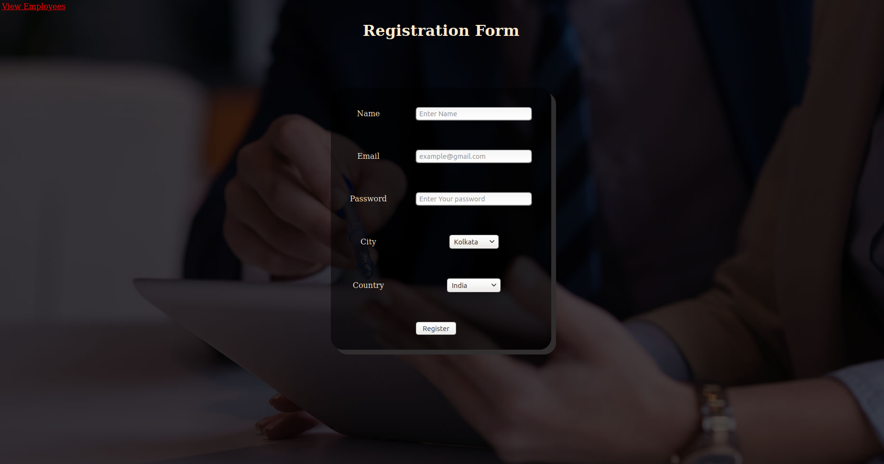

# Registration_Login
This project is based on the concept, how the registration and login system works using the HttpSession. First the user come across a registration page where he/she need to put his/her details. The Registration page also contains a link which when clicked will redirect to a page where all the employee details are kept in the form a table. But to view the employee details the user must register first. If the user press the view employee link before registering then the ShowEmployee Servlet will be fired which will force the user to login first before viewing the employee details. Once the employee login(old user)/ register(new user) then he/she can see the employee detals page. On the employee details page there is a link to log out, which when clicked would invalidate the Http Session and the user will again be redirected to the registration page.
# Concepts Used:
HTML,
CSS,
Servlet,
Http Session,
JDBC.

